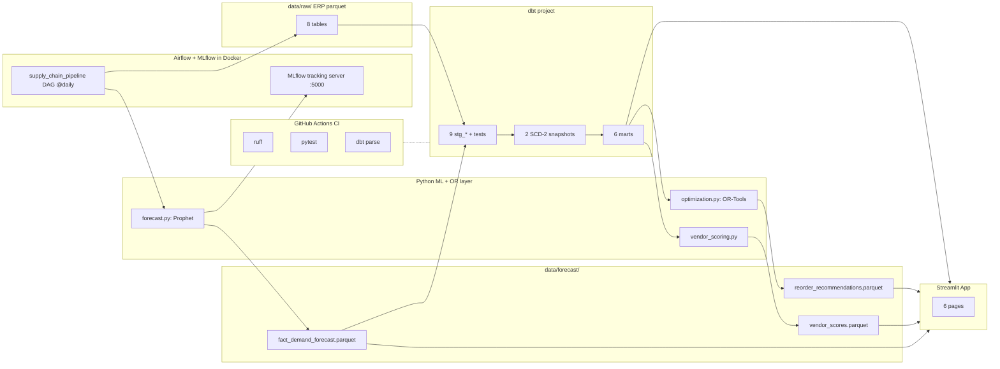

# Supply Chain Control Tower

> **Capstone analytics-engineering + ML + operations-research + DevOps platform.**
> Two years of synthetic ERP supply chain data → dbt marts in DuckDB →
> Prophet demand forecasts (tracked in MLflow) → OR-Tools reorder-point
> optimization → 6-page Streamlit dashboard, all orchestrated by Airflow on
> Docker and shipped through GitHub Actions CI.

This is project 4 of a four-project portfolio. Each project layers a new
production-grade capability on top of the previous one:

| # | Project | Stack | What it adds |
|---|---|---|---|
| 1 | SaaS Growth | DuckDB raw + Streamlit + Sphinx | Baseline analytics |
| 2 | FinTech Credit Risk | + dbt | Modern transformation layer |
| 3 | Ops Control Tower | + Airflow + Docker | Production orchestration |
| **4** | **Supply Chain (this)** | **+ Prophet + MLflow + OR-Tools + GitHub Actions CI + dbt snapshots** | **Full ML / OR / DevOps capstone** |

---

## What it does

1. **Generates** 2 years of ERP-style supply-chain data — 500 SKUs, 20 vendors,
   5 warehouses, ~1.1M rows of daily demand, 30K orders, 4K POs, 30K shipments
   — with realistic causal correlations (longer vendor lead times → higher
   arrival variance, seasonal SKUs → weekly + Black Friday spikes, etc.).
2. **Transforms** the raw parquet files into 9 staging views, 3 intermediate
   models, 6 marts, and 2 SCD-2 snapshots (`vendor_contract_snapshot`,
   `sku_pricing_snapshot`) with **dbt-core + dbt-duckdb**, including ~100
   schema tests and 2 singular SQL tests.
3. **Forecasts** 30-day SKU × warehouse demand with **Prophet** (weekly +
   yearly seasonality, US holiday regressors), logging every fit to a
   dedicated **MLflow** tracking server with MAPE / WAPE / bias holdout
   metrics.
4. **Optimizes** reorder points with **Google OR-Tools** (GLOP solver,
   convex-cost LP over a candidate grid) subject to a per-ABC service-level
   floor; benchmarks the result against a textbook safety-stock formula and
   surfaces the cost savings on the dashboard.
5. **Scores** vendors with a four-component composite (lead-time overshoot,
   late-arrival rate, defect rate, lead-time variance) for the scorecard
   dashboard.
6. **Visualizes** everything in a 6-page **Streamlit** app — Executive
   Overview, Inventory Health, Forecast Accuracy, Replenishment, Vendor
   Scorecard, Warehouse Performance.
7. **Orchestrates** the daily pipeline with **Airflow on Docker Compose**.
   The DAG runs *generate → dbt build (pre-forecast) → forecast → dbt build
   (post-forecast) → optimize → vendor scoring → alerts*.
8. **Lints, tests, and validates** every push and PR via **GitHub Actions**
   (ruff + pytest + dbt parse), with **Dependabot** keeping deps current.

---

## Architecture



---

## Quickstart

Pre-requisites: `pyenv`, `pyenv-virtualenv`, `docker`, `docker compose`.

```bash
# 1. Set up the Python 3.13 env
pyenv install -s 3.13.3
pyenv virtualenv 3.13.3 supply_env
pyenv local supply_env

# 2. Bootstrap (installs core, dev, dbt, streamlit, docs deps + dbt packages)
make all-env

# 3. Start Airflow + MLflow tracking server in Docker
cp .env.example .env
make airflow-up
# Airflow UI: http://localhost:8080  (admin/admin)
# MLflow UI:  http://localhost:5000

# 4. Run the pipeline locally (host-side, faster for iteration)
make generate           # ERP parquet -> data/raw/
make dbt-build-pre      # 9 staging + 3 intermediate + 4 forecast-independent marts
export MLFLOW_TRACKING_URI=http://localhost:5000
make forecast           # Prophet + MLflow on top-50 SKUs
make dbt-build-post     # rebuild mart_forecast_accuracy + mart_reorder_recommendations
make optimize           # OR-Tools reorder-point optimization
make analyze            # vendor scoring + alerts log

# 5. Browse the dashboard
make app
# http://localhost:8501

# 6. Or trigger the DAG end-to-end
make airflow-trigger
```

---

## Project layout

```
supply-chain-optimization/
├── airflow/                   custom Dockerfile + DAG
├── dbt_project/               9 staging + 3 intermediate + 6 marts + 2 snapshots
├── python/src/
│   ├── generate_data.py       8 ERP parquet tables, causally correlated
│   ├── forecast.py            Prophet + MLflow
│   ├── optimization.py        OR-Tools (GLOP)
│   ├── safety_stock.py        Textbook benchmark formulas
│   ├── vendor_scoring.py      Composite scorer
│   ├── analysis.py            Top-level orchestrator
│   └── metrics.py             KPI helpers
├── streamlit_app/             app.py + 6 pages + utils/data_loader.py
├── tests/                     104 Python tests (7 files)
├── docs/                      Sphinx (Furo theme) — 9 .rst pages
├── .github/                   ci.yml + dependabot.yml
├── docker-compose.yml         Airflow + Postgres + MLflow tracking server
├── pyproject.toml             prophet, mlflow, ortools + dbt + streamlit + docs extras
└── Makefile                   make help
```

---

## Tests

`make test` (or `pytest`) runs 104 tests across 7 files:

- `test_generate_data.py` — 25 schema + causal-correlation assertions on the
  generated parquet (e.g. *seasonal SKUs must show wider weekly demand swings
  than non-seasonal ones*).
- `test_dbt_pipeline.py` — 24 integration tests against the materialized
  DuckDB warehouse (mart shapes, snapshot existence, cross-mart consistency).
- `test_forecast.py` — Prophet wrapper returns the right horizon length;
  MLflow URI fail-fast behavior is verified; an end-to-end smoke test fits
  Prophet on synthetic data with a temp file-store URI.
- `test_optimization.py` — OR-Tools optimizer respects the service-level
  floor; higher penalties → higher reorder points; tested over multiple
  service levels.
- `test_safety_stock.py` — textbook formula matches known z-score
  calculations; combined-variance formula collapses to textbook when
  lead-time is certain.
- `test_vendor_scoring.py` — composite score bounded in [0, 100]; ranking is
  stable for tied vendors; missing-column validation.
- `test_metrics.py` — MAPE / WAPE / bias / fill-rate / OTIF helpers.

Plus ~100 dbt schema tests + 2 singular SQL tests run by `dbt build`.

---

## Why this stack

Supply chain is the canonical home of two industry-distinctive analytics
skills: **time-series demand forecasting** and **mathematical optimization**
for inventory decisions. This project leans into both, plus adds CI/CD as
the production-engineering polish.

| Layer | Tool | Why |
|---|---|---|
| Source schema | ERP-style (SAP / NetSuite-inspired) | What real supply-chain analysts work with |
| Warehouse | DuckDB | Fast local analytics, zero infra |
| Transformation | **dbt-core + dbt-duckdb** | Industry-standard transformation |
| **dbt snapshots** | **SCD-2 vendor + SKU history** | Tracks contract drift over time |
| Orchestration | **Apache Airflow** (Docker Compose) | Same pattern as project 3, now with ML/OR steps |
| **Forecasting** | **Prophet** | Industry standard for SKU-level demand |
| **Experiment tracking** | **MLflow** | Find degrading models across hundreds of series |
| **Optimization** | **Google OR-Tools (GLOP)** | Cost-minimizing reorder points |
| Dashboard | Streamlit + Plotly | Same as previous projects |
| **CI/CD** | **GitHub Actions** | Lint + tests + dbt parse on every push |
| Docs | Sphinx + Furo | Same as previous projects |

---

## Documentation

The Sphinx site (Furo theme) covers:

- `business_problem.rst` — pain points, target personas, success metrics
- `data_dictionary.rst` — every source + transformed table, including the
  runtime forecast artifact at `data/forecast/fact_demand_forecast.parquet`
- `metric_dictionary.rst` — every KPI with formula + business meaning
- `forecasting_methodology.rst` — Prophet config, MLflow workflow,
  `MLFLOW_TRACKING_URI` env contract, fail-fast behavior
- `optimization_methodology.rst` — LP formulation, decision variables,
  constraints, OR-Tools solver choice, vs textbook benchmark
- `orchestration.rst` — Airflow setup, custom Dockerfile, **the two-phase
  dbt build pattern** (pre-forecast then post-forecast)
- `cicd.rst` — GitHub Actions workflow walkthrough, Dependabot config
- `executive_summary.rst` — one-page narrative

`make docs` builds + serves with live reload.
